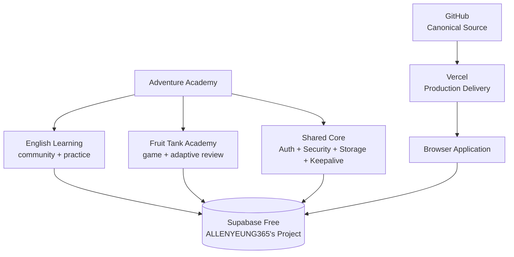
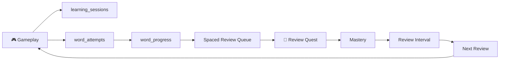
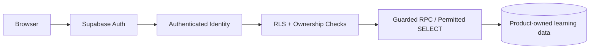

# 🍓 Fruit Tank Academy

> **Shoot letters. Spell fruit. Learn English.**
>
> A gamified English learning platform that combines interactive spelling practice, adaptive review, spaced reinforcement, learning analytics, and cloud-based learner progress into one adventure-driven experience.

<p align="center">
  <a href="https://fruit-tank-academy-p8dlqmq8g-allen-yeungs-projects.vercel.app/"><strong>🎮 PLAY LIVE</strong></a> ·
  <a href="https://github.com/ALLENYEUNG365/Fruit-Tank-Spelling-Game"><strong>💻 SOURCE CODE</strong></a>
</p>

<p align="center">
  
  
  
  
  
</p>

> **Portfolio positioning:** Fruit Tank Academy is a deployable EdTech product prototype—not only a browser game. It connects gameplay, learning evidence, adaptive review, cloud data, and security-aware application architecture.

---

## 🖼️ Product Showcase

> **Screenshots are intentionally left as placeholders.** Replace each block with your latest production screenshot when ready. Recommended image width: 1400–1800 px.

### 🎮 Gameplay

```text
┌───────────────────────────────────────────────────────────────┐
│                     SCREENSHOT PLACEHOLDER                    │
│                                                               │
│  Fruit Tank gameplay — tank · fruit target · letters · HUD    │
│                                                               │
└───────────────────────────────────────────────────────────────┘
```

### 🧠 Review Quest

```text
┌───────────────────────────────────────────────────────────────┐
│                     SCREENSHOT PLACEHOLDER                    │
│                                                               │
│  Personalized review queue · mastery · next review · drill   │
│                                                               │
└───────────────────────────────────────────────────────────────┘
```

### 👤 Student Academy

```text
┌───────────────────────────────────────────────────────────────┐
│                     SCREENSHOT PLACEHOLDER                    │
│                                                               │
│  Student portal · progress · game access · Academy navigation │
│                                                               │
└───────────────────────────────────────────────────────────────┘
```

### 📊 Teacher / Analytics

```text
┌───────────────────────────────────────────────────────────────┐
│                     SCREENSHOT PLACEHOLDER                    │
│                                                               │
│  Teacher insights · learner progress · classroom analytics    │
│                                                               │
└───────────────────────────────────────────────────────────────┘
```

---

## 🎥 Demo Video

**Latest demo:**

👉 `[INSERT YOUR NEW DEMO VIDEO LINK HERE]`

You can replace the placeholder with Google Drive, YouTube, Loom, or another public demo URL.

---

## 🚀 Product at a glance

| | |
|---|---|
| 🎮 **Game-Based Learning** | Spell fruit vocabulary by moving a tank and shooting letters in sequence. |
| 🧠 **Adaptive Review** | Review-due and difficult vocabulary is surfaced in a focused Review Quest. |
| ☁️ **Cloud Learning Data** | Authenticated sessions, attempts, progress, quests, and learner metrics sync to Supabase. |
| 🔐 **Security by Design** | RLS, ownership checks, and guarded RPCs protect learning data and privileged writes. |
| 📊 **Learning Evidence** | Gameplay produces structured evidence that can feed mastery and spaced-review logic. |
| 📱 **Responsive** | Designed for desktop keyboard play and mobile on-screen controls. |

---

## 🧭 Architecture

### Visual architecture diagram

The full Mermaid architecture source is available in [`docs/ARCHITECTURE-DIAGRAM.md`](docs/ARCHITECTURE-DIAGRAM.md).



### Learning data flow



### Security flow



---

## 🧠 Learning loop

```text
Discover vocabulary
       ↓
See the target word
       ↓
Recall the spelling
       ↓
Move the tank
       ↓
Shoot letters in order
       ↓
Immediate feedback
       ↓
Record learning evidence
       ↓
Adaptive review
       ↓
Spaced reinforcement
       ↓
Return to the next quest
```

The goal is to turn passive spelling recall into a short **action → feedback → reflection → repetition** cycle.

---

## 🎮 Gameplay

### Order-based spelling

Learners complete each word letter-by-letter. The target sequence matters, so the task measures retrieval rather than simple whole-word recognition.

### Tank-based interaction

A lightweight tank mechanic adds movement, timing, and targeting to spelling practice.

### Difficulty modes

| Mode | Time per word | Learning use |
|---|---:|---|
| Easy | 60 seconds | First exposure / confidence building |
| Normal | 40 seconds | Regular retrieval practice |
| Hard | 20 seconds | Faster recall challenge |

### Controls

**Desktop:** `←` / `→` to move, `Space` to fire or hold to auto-fire.

**Mobile:** on-screen movement and fire controls.

---

## 🧠 Adaptive Review Quest

The game is connected to a dedicated review experience so gameplay can continue into targeted practice.

```text
Game attempt
    ↓
word_attempts
    ↓
word_progress
    ↓
review queue
    ↓
Focused drill
    ↓
mastery / interval / next review
```

The current queue can use signals including recent mistakes, wrong-letter patterns, mastery level, review due time, repeated difficulty, and previous review performance.

---

## ☁️ Cloud architecture

Fruit Tank intentionally shares one Supabase Free project with the wider Adventure Academy ecosystem while maintaining strict business-domain separation.

```text
ALLENYEUNG365's Project
│
├── English Learning
│   ├── users
│   ├── posts
│   └── checkins
│
├── Fruit Tank
│   ├── profiles
│   ├── classes
│   ├── class_memberships
│   ├── learning_sessions
│   ├── word_attempts
│   ├── word_progress
│   ├── learning_mastery
│   └── daily_quests
│
└── Shared Core
    ├── Supabase Auth
    ├── Storage / platform services
    ├── keepalive
    └── shared security / RPC conventions
```

> **Shared infrastructure ≠ shared business tables.**

The English Learning and Fruit Tank products share platform infrastructure, but each product owns its own business data.

---

## 🔐 Security model

The browser uses a public Supabase browser key; it never contains service-role credentials or database passwords.

```text
Authenticated user
      ↓
Supabase Auth identity
      ↓
RLS / ownership checks
      ↓
Guarded RPC or permitted SELECT
      ↓
Product-owned learning tables
```

Core protections include RLS on business data, ownership checks inside guarded functions, server-side recalculation of letter correctness, session ownership validation, locked-down `search_path` for SECURITY DEFINER functions, and no service-role key in browser code.

---

## 🗃️ Learning data model

```text
Profile
  ├── XP / level / streak
  ├── total words
  └── accuracy metrics

Session
  ├── world
  ├── difficulty mode
  ├── score
  ├── words completed
  └── duration

Word Attempt
  ├── target letter
  ├── selected letter
  ├── correctness
  ├── session
  └── world

Word Progress
  ├── attempts
  ├── correct attempts
  ├── mastery state
  └── last attempt

Review
  ├── quality
  ├── mastery
  ├── interval
  └── next review time
```

Gameplay therefore creates reusable learning evidence rather than a one-off game score.

---

## 🧩 Vocabulary

The current fruit vocabulary includes examples such as:

**apple · banana · orange · grape · peach · pear · mango · lemon · cherry · strawberry**

The vocabulary layer can expand without redesigning the underlying learning architecture.

---

## 🛠️ Technology stack

| Layer | Technology |
|---|---|
| Game UI | HTML5, CSS3, Vanilla JavaScript |
| Rendering | HTML Canvas |
| Audio | Web Audio API |
| Authentication | Supabase Auth |
| Database | Supabase PostgreSQL |
| Security | RLS + guarded RPCs |
| Hosting | Vercel |
| Source | GitHub |
| Learning model | Adaptive review + spaced reinforcement |

---

## 📁 Repository map

```text
Fruit-Tank-Spelling-Game/
├── index.html
├── auth.html
├── student-portal.html
├── play.html
├── game.html
├── game-core.html
├── adaptive-review.html
├── dashboard.html
├── teacher-insights.html
├── supabase-config.js
├── cloud-sync-core.js
├── supabase/
│   ├── schema.sql
│   └── migrations/
├── docs/
│   ├── ARCHITECTURE.md
│   └── ARCHITECTURE-DIAGRAM.md
└── README.md
```

---

## 🔗 Live product

### Production

👉 **https://fruit-tank-academy-p8dlqmq8g-allen-yeungs-projects.vercel.app/**

### GitHub

👉 **https://github.com/ALLENYEUNG365/Fruit-Tank-Spelling-Game**

### Demo video

👉 **[INSERT YOUR NEW DEMO VIDEO LINK HERE]**

---

## 💡 Why this project matters

Fruit Tank Academy demonstrates how game mechanics, English learning, adaptive review, cloud architecture, and security-aware data design can fit together in one deployable learning product.

The project started as a spelling-game experiment and has evolved into a portfolio-ready EdTech product prototype with persistent learner state, structured learning evidence, a review loop, and a clear production boundary.

---

## 👤 Creator

**Allen Yeung**  
Education · Digital Technology · AI & Cloud Learning

Building practical, technology-enhanced learning experiences that connect interaction design with measurable educational outcomes.

---

## 📌 Project status

**Active EdTech product prototype / portfolio project**

Core gameplay, authentication, cloud progress synchronization, and adaptive review are implemented and deployed. Future work can expand the vocabulary library, classroom tooling, analytics, teacher workflows, and more advanced server-authoritative review logic.

---

## 📄 License

No license file is currently included. All rights reserved unless otherwise stated by the repository owner.
